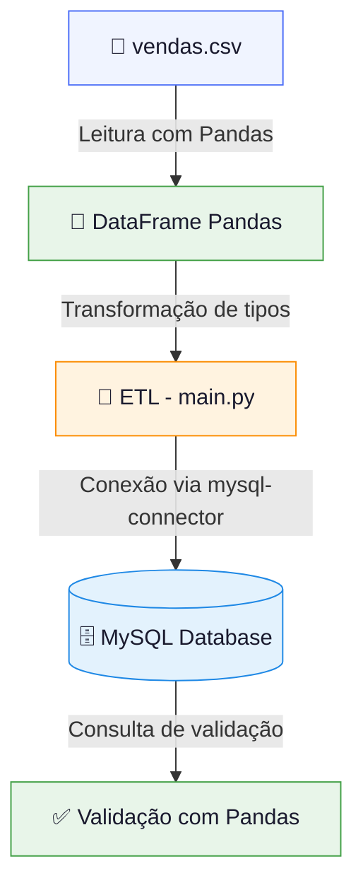
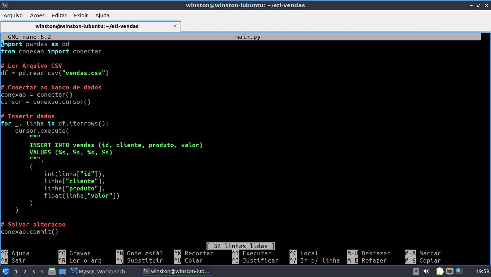
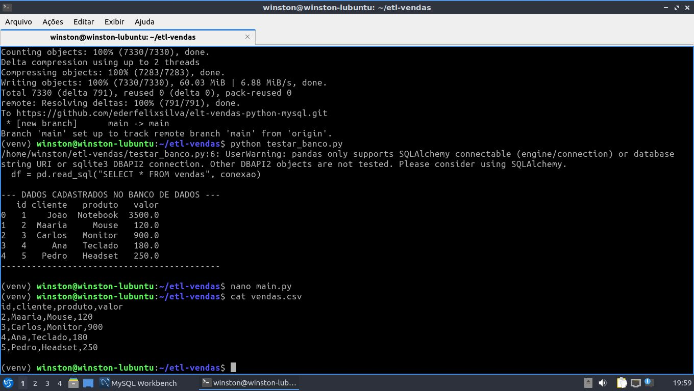
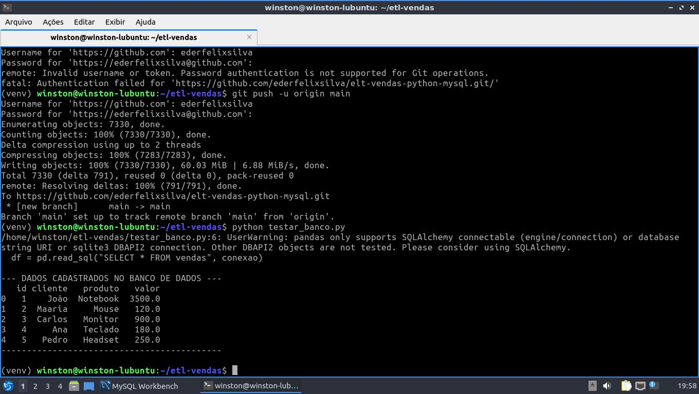

<div align="center">

# 🗄️ ETL Vendas

### Pipeline ETL local com Python · Pandas · MySQL

[](https://python.org)
[](https://pandas.pydata.org)
[](https://mysql.com)
[](https://lubuntu.me)
[](https://git-scm.com)
[](https://github.com)

<br/>

> Pipeline ETL desenvolvido em ambiente Linux para ingestão, transformação e carga de dados de vendas  
> a partir de arquivos CSV diretamente em um banco de dados MySQL relacional.

<br/>


</div>

---

## 📋 Índice

- [Sobre o Projeto](#-sobre-o-projeto)
- [Arquitetura do Pipeline](#-arquitetura-do-pipeline)
- [Stack Utilizada](#-stack-utilizada)
- [Estrutura do Projeto](#-estrutura-do-projeto)
- [Como Executar](#-como-executar)
- [Demonstração](#-demonstração)
- [Troubleshooting & Lições Aprendidas](#-troubleshooting--lições-aprendidas)
- [Resultado Final](#-resultado-final)
- [Autor](#-autor)

---

## 📌 Sobre o Projeto

Este projeto implementa um **pipeline ETL (Extract, Transform, Load)** completo, executado localmente em **Lubuntu Linux**, com o objetivo de processar dados de vendas armazenados em arquivos `.csv` e carregá-los em um banco de dados relacional **MySQL**.

O projeto foi desenvolvido como parte do meu portfólio de Engenharia de Dados, consolidando habilidades práticas em:

- Manipulação de dados com **Pandas**
- Conexão e operações em banco de dados com **mysql-connector-python**
- Estruturação de pipelines ETL com **Python puro**
- Versionamento com **Git/GitHub**
- Ambiente de desenvolvimento **Linux**

---

## 🏗️ Arquitetura do Pipeline



### Etapas do Pipeline

| Etapa | Arquivo | Descrição |
|-------|---------|-----------|
| **Extract** | `main.py` | Leitura do `vendas.csv` via `pd.read_csv()` |
| **Transform** | `main.py` | Conversão de tipos, limpeza e formatação dos dados |
| **Load** | `main.py` + `conexao.py` | Inserção dos registros no MySQL via `cursor.execute()` |
| **Validate** | `testar_banco.py` | Consulta e exibição dos dados carregados com Pandas |

---

## 🛠️ Stack Utilizada

| Camada | Tecnologia | Versão |
|--------|-----------|--------|
| **Sistema Operacional** | Lubuntu Linux | Ubuntu base |
| **Linguagem** | Python | 3.x |
| **Manipulação de Dados** | Pandas | 2.x |
| **Conector de Banco** | mysql-connector-python | latest |
| **Banco de Dados** | MySQL | 8.x |
| **Versionamento** | Git + GitHub | — |
| **Editor** | VS Code | — |
| **Terminal** | Bash (Linux) | — |

---

## 📁 Estrutura do Projeto

```
etl-vendas/
│
├── 📄 vendas.csv          # Fonte de dados brutos (input do pipeline)
├── 🐍 main.py             # Orquestrador principal do ETL (Extract → Transform → Load)
├── 🔌 conexao.py          # Módulo de conexão com o banco MySQL
├── 🧪 testar_banco.py     # Script de validação e consulta ao banco
├── 📖 README.md           # Documentação do projeto
└── 📦 venv/               # Ambiente virtual Python (não versionado)
```

### Responsabilidade de cada arquivo

<details>
<summary><strong>📄 vendas.csv</strong> — Fonte de dados</summary>

Arquivo de entrada do pipeline. Contém os registros de vendas com colunas como data, produto, quantidade e valor. Representa a camada de origem (source layer) do ETL.

</details>

<details>
<summary><strong>🐍 main.py</strong> — Orquestrador ETL</summary>

Arquivo principal do pipeline. Executa as três etapas em sequência:
1. **Extract:** leitura do CSV com `pd.read_csv()`
2. **Transform:** conversão de tipos e tratamento dos dados
3. **Load:** iteração sobre o DataFrame e inserção no MySQL via `cursor.execute()`

</details>

<details>
<summary><strong>🔌 conexao.py</strong> — Módulo de conexão</summary>

Encapsula a lógica de conexão com o MySQL usando `mysql.connector.connect()`. Centraliza as credenciais e retorna um objeto de conexão reutilizável, separando responsabilidades do pipeline.

</details>

<details>
<summary><strong>🧪 testar_banco.py</strong> — Validação</summary>

Script criado para validar a conectividade com o banco e verificar os dados carregados. Surgiu como solução prática durante o troubleshooting do erro de autenticação MySQL (ver seção de lições aprendidas).

</details>

---

## ▶️ Como Executar

### Pré-requisitos

```bash
# Python 3 instalado
python3 --version

# MySQL instalado e rodando
sudo systemctl status mysql
```

### Instalação

```bash
# 1. Clone o repositório
git clone https://github.com/ederfelixsilva/elt-vendas-python-mysql.git
cd etl-vendas

# 2. Crie e ative o ambiente virtual
python3 -m venv venv
source venv/bin/activate

# 3. Instale as dependências
pip install pandas mysql-connector-python
```

### Configuração do Banco

```sql
-- Execute no MySQL antes de rodar o ETL
CREATE DATABASE vendas_db;
CREATE USER 'etl_user'@'localhost' IDENTIFIED BY 'sua_senha';
GRANT ALL PRIVILEGES ON vendas_db.* TO 'etl_user'@'localhost';
FLUSH PRIVILEGES;
```

### Execução

```bash
# Testar conectividade com o banco
python3 testar_banco.py

# Executar o pipeline ETL completo
python3 main.py
```

---

## 🖥️ Demonstração

### Código do Pipeline — `main.py`

> `main.py` aberto no editor nano: lógica completa do ETL com leitura do CSV, conexão ao banco e inserção dos dados via `cursor.execute()`



---

### Validação + Dados de Entrada — `testar_banco.py` & `vendas.csv`

> Execução de `python testar_banco.py` retornando os dados cadastrados no banco via Pandas, seguida do `cat vendas.csv` exibindo o arquivo de origem



---

### Estrutura do Projeto — `tree` no terminal

> Saída do comando `tree` exibindo os arquivos do projeto após o `git push` bem-sucedido para o repositório remoto



---

## 🧩 Troubleshooting & Lições Aprendidas

Esta seção documenta os principais erros encontrados durante o desenvolvimento, suas causas raiz e as soluções aplicadas. Uma das competências mais valorizadas em Engenharia de Dados é a capacidade de **diagnosticar e resolver falhas técnicas de forma sistemática**.

---

### 🔴 Erro 1 — `SyntaxError: '(' was never closed`

**Contexto:**  
Ocorreu durante a escrita da instrução `cursor.execute()` no `main.py`.

**Causa raiz:**  
Parêntese de abertura não fechado corretamente no bloco da chamada SQL, quebrando a estrutura sintática do Python antes que o interpretador conseguisse finalizar a análise do token.

**Solução:**  
Revisão manual da estrutura do bloco, utilizando a indentação do VS Code para identificar o nível de aninhamento e garantir que todos os parênteses estivessem balanceados.

**Lição:**  
> Editores como VS Code destacam parênteses correspondentes ao posicionar o cursor. Usar esse recurso reduz a ocorrência desse tipo de erro, especialmente em strings SQL multilinha.

---

### 🔴 Erro 2 — `IndentationError`

**Contexto:**  
Apareceu dentro de um loop `for` que iterava sobre as linhas do DataFrame para inserção no banco.

**Causa raiz:**  
Mistura de tabulações e espaços, ou número inconsistente de espaços no bloco interno do `for`. O Python exige **exatamente 4 espaços por nível de indentação** (PEP 8).

**Solução:**  
Reescrita do bloco com indentação uniforme de 4 espaços. Ativação da opção _"Render Whitespace"_ no VS Code para tornar os caracteres invisíveis visíveis.

**Lição:**  
> Configurar o editor para usar espaços (não tabs) e exibir whitespace elimina essa classe de erro. No VS Code: `Settings → Editor: Insert Spaces → true`.

---

### 🔴 Erro 3 — Erro de Sintaxe SQL (`VALEUS` / `VLAUES`)

**Contexto:**  
A query de inserção falhou silenciosamente ou lançou exceção ao ser executada pelo `cursor.execute()`.

**Causa raiz:**  
Palavra-chave `VALUES` digitada incorretamente no corpo da string SQL, gerando um erro de parsing no lado do servidor MySQL.

**Solução:**  
Revisão da string SQL com atenção às palavras reservadas. Boa prática: formatar a query SQL em variável separada antes de passá-la ao `execute()`, facilitando a leitura.

```python
# ✅ Boa prática: separar a query em variável
query = """
    INSERT INTO vendas (produto, quantidade, valor)
    VALUES (%s, %s, %s)
"""
cursor.execute(query, (row['produto'], row['quantidade'], row['valor']))
```

**Lição:**  
> Isolar strings SQL em variáveis nomeadas melhora a legibilidade e facilita o debugging. Considere usar um linter SQL ou o próprio MySQL Workbench para validar queries antes de executá-las via Python.

---

### 🔴 Erro 4 — `AttributeError` na conexão MySQL

**Contexto:**  
Erro ao instanciar a conexão com o banco no `conexao.py`.

**Causa raiz:**  
Chamada ao método com typo:

```python
# ❌ Errado
mysql.connector.conect(...)
```

**Solução:**  
Correção do nome do método:

```python
# ✅ Correto
mysql.connector.connect(...)
```

**Lição:**  
> Autocompletar do VS Code (IntelliSense) teria evitado esse erro. Configurar o ambiente com a biblioteca instalada no ambiente virtual garante que o editor sugira os métodos corretos.

---

### 🔴 Erro 5 — `1045 (28000): Access denied for user 'root'@'localhost'`

**Contexto:**  
Erro crítico de autenticação ao tentar conectar via Python. O MySQL aceitava o login no terminal (`sudo mysql`), mas rejeitava a conexão programática com senha.

**Causa raiz:**  
Conflito entre dois plugins de autenticação do MySQL:
- `auth_socket` — autentica via socket do SO, sem senha (padrão para `root` no Ubuntu)
- `mysql_native_password` — autentica via senha convencional, necessário para conexões programáticas

Como o usuário `root` estava usando `auth_socket`, qualquer tentativa de conexão via senha (Python) era bloqueada com erro 1045.

**Abordagem adotada:**  
Enquanto o conflito de autenticação era investigado, foi criado o arquivo `testar_banco.py` para isolar e validar a conectividade de forma incremental — separando o problema de autenticação do problema de lógica ETL.

**Solução definitiva:**

```sql
-- Alterar o plugin de autenticação do root (ou criar novo usuário)
ALTER USER 'root'@'localhost' IDENTIFIED WITH mysql_native_password BY 'sua_senha';
FLUSH PRIVILEGES;
```

**Lição:**  
> Em ambientes Ubuntu/Debian, o MySQL usa `auth_socket` por padrão para o `root`. Para conexões programáticas, sempre prefira criar um usuário dedicado com `mysql_native_password`. Isso também é uma boa prática de segurança (princípio do menor privilégio).

---

## ✅ Resultado Final

Ao final do desenvolvimento, o pipeline ETL estava **100% funcional**, com todas as etapas validadas:

| Etapa | Status |
|-------|--------|
| 📄 CSV lido e carregado como DataFrame | ✅ Concluído |
| 🗄️ Banco de dados MySQL criado | ✅ Concluído |
| 📊 Tabela `vendas` criada com schema correto | ✅ Concluído |
| 🔌 Integração Python → MySQL funcional | ✅ Concluído |
| 🔄 Pipeline ETL executando end-to-end | ✅ Concluído |
| 🧪 Dados validados via consulta com Pandas | ✅ Concluído |

---

## 📚 O que Aprendi

- Como estruturar um pipeline ETL do zero em Python
- Conexão e operações em MySQL via código Python
- Debugging sistemático de erros de sintaxe, indentação e autenticação
- Diferença entre `auth_socket` e `mysql_native_password` no MySQL/Ubuntu
- Boas práticas de organização de código (separação de responsabilidades por arquivo)
- Uso de ambiente virtual (`venv`) para isolamento de dependências

---

## 🚀 Próximos Passos

- [ ] Adicionar tratamento de exceções robusto (`try/except`) em todas as etapas
- [ ] Parametrizar credenciais via arquivo `.env` (usando `python-dotenv`)
- [ ] Adicionar logging estruturado com o módulo `logging`
- [ ] Implementar idempotência no pipeline (evitar duplicatas na carga)
- [ ] Migrar para execução agendada com `cron` ou Apache Airflow
- [ ] Containerizar com Docker para portabilidade

---

## 👤 Autor

<div align="center">

**Seu Nome**

[](https://github.com/ederfelixsilva)
[](https://linkedin.com/in/seu-perfil)

_Desenvolvedor em transição para Engenharia de Dados_  
_Aberto a oportunidades de estágio e posições júnior_

</div>

---

<div align="center">

⭐ Se este projeto foi útil, considere deixar uma estrela no repositório!

<sub>Desenvolvido com 🐍 Python + 🐼 Pandas + 🗄️ MySQL em 🐧 Linux</sub>

</div>
